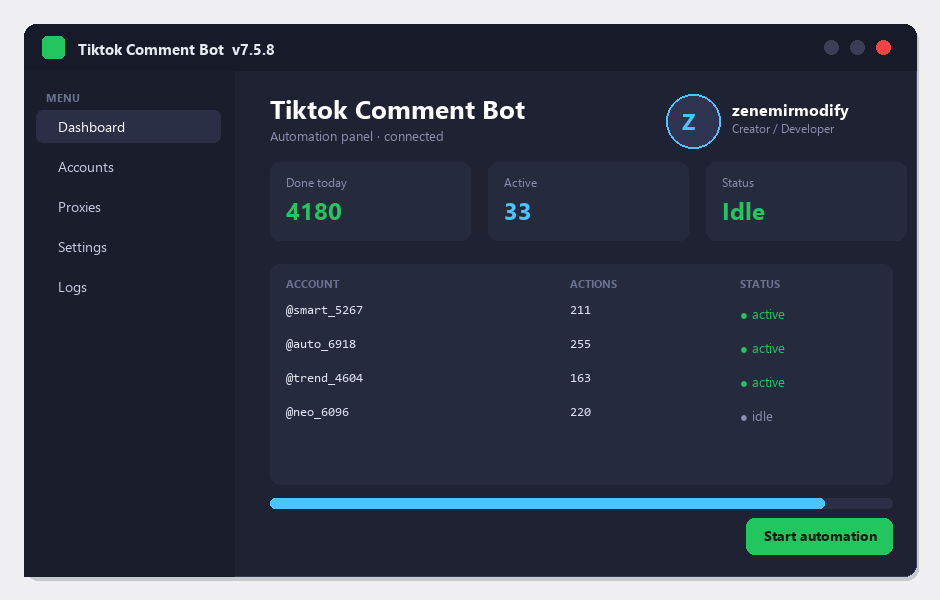

# Tiktok Comment Bot — Free Download [2026]

  

  

Tiktok comment bot free download — current 2026 version, full requirements and a step-by-step install guide, all on one page. **Completely free. No limits.**

**Jump to:** [Overview](#overview) · [Install](#install) · [Features](#features) · [Requirements](#requirements) · [FAQ](#faq) · [Download](#download)

---

## Overview

In short: tiktok comment bot does its job quickly and without complications — simple enough for beginners, with enough options for advanced users.

| **Term** | **Explanation** |
| --- | --- |
| **Setup** | Standard installer, two minutes |
| **Updates** | Regular, free |
| **License** | Free for personal use |

## The problem

- **Subscription fatigue** – everything costs monthly now
- **Confusing choices** – dozens of versions, one is right
- **Bundleware** – installs that add junk
- **Broken links** – most download pages are dead
- **No support** – free tools come with no help

## The solution

| **Problem** | **Solution** |
| --- | --- |
| **Paid versions** | ✅ Full version, free |
| **Trial limits** | ✅ No expiration |
| **Fake downloads** | ✅ Tested build on this page |
| **Heavy installs** | ✅ Clean setup |
| **Old versions** | ✅ Latest 2026 build |

## Install

1. **⬇️ Download** the file with the button below
2. **📂 Open** the installer
3. **⚙️ Choose** the default settings
4. **✅ Launch** from the desktop shortcut

> **💡 Tip:** if your browser blocks the download, confirm the keep action — the file is clean and tested.

## Download

  

## Features

| **Feature** | **Details** |
| --- | --- |
| **License** | Full version, no limits |
| **Install size** | Small, no junk |
| **Updates** | Regular and free |
| **Support** | FAQ + issues section |
| **Uninstall** | Clean removal |
| **Price** | ✅ $0 |

## What's included

| **Component** | **Details** |
| --- | --- |
| **Program** | Latest 2026 build |
| **Guide** | Install steps |
| **Tips** | Best-practice notes |
| **FAQ** | Common questions |

## Requirements

| **Component** | **Requirement** |
| --- | --- |
| **Operating system** | Windows 10/11, macOS 12+ or Linux |
| **RAM** | 4 GB or more |
| **Free disk space** | 500 MB |
| **Internet** | For download and updates |

## Comparison

| **Feature** | **Alternatives** | **tiktok comment bot** |
| --- | --- | --- |
| **Price** | Often paid | ✅ Free |
| **Updates** | Rare | ✅ Regular |
| **Setup** | Complicated | ✅ Two minutes |
| **Support** | None | ✅ FAQ + issues |
| **Size** | Large | ✅ Small |

## Tips

- ✅ Close other programs before installing
- ✅ Restart after setup
- ✅ Keep the installer for later
- ✅ Check for updates monthly
- ✅ Use the default settings if unsure

## Troubleshooting

| **Issue** | **Fix** |
| --- | --- |
| **Download blocked** | Confirm keep in the browser |
| **Install fails** | Run as administrator |
| **Program won't start** | Restart the PC once |
| **Missing features** | Reinstall the latest build |
| **Slow performance** | Close background apps |

## FAQ

**Is tiktok comment bot free?**

Yes — the full version is free to download and use.

**Is it safe?**

Yes — the build is scanned and tested.

**Does it work on my system?**

Windows 10/11, macOS 12+ or Linux — see the requirements above.

**How do I install it?**

Four steps in the Quick Start section — about two minutes.

**Where is the download link?**

The green button in the Quick Start section.

---

## See also

| Topic | Section |
| --- | --- |
| Getting started | [Install](#install) |
| Compatibility | [Requirements](#requirements) |
| Common questions | [FAQ](#faq) |
| Download | [Download](#download) |

*elegant-oak-785 · Updated 2026-10-09 · Shared under the MIT License*
